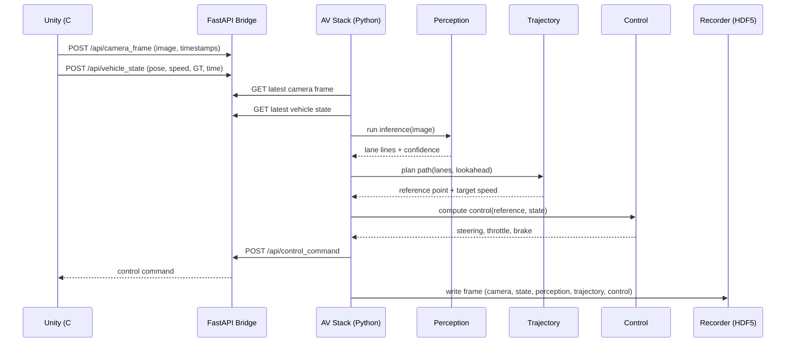
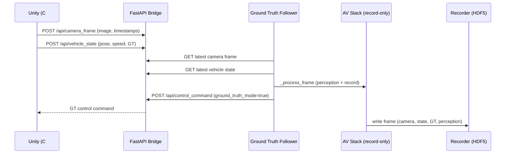

# AV Stack Architecture

## Overview

The system is an autonomous vehicle (AV) stack built around a Unity simulator and a
Python control pipeline. Unity provides camera frames and vehicle state, Python runs
perception, trajectory planning, and control, and a bridge layer exchanges messages
between the two. Recordings are written to HDF5 for offline analysis.

High-level flow:
1. Unity captures camera frames and vehicle state.
2. Bridge (FastAPI) receives Unity data.
3. Perception estimates lane geometry and quality.
4. Trajectory planning generates a reference path and target speed.
5. Control computes steering/throttle/brake.
6. Bridge returns control commands to Unity.
7. Recorder logs all data for analysis and visualization.

## Sequence Diagrams

### Full AV Stack (Perception -> Trajectory -> Control)

### Ground Truth Runner (GT Mode)

## Layers

### Unity Simulation (C#)
**Responsibilities**
- Render scene and provide camera frames.
- Produce vehicle state (pose, speed, timestamps).
- Apply control commands to the car.
- Provide ground truth path/lane geometry when available.

**Key components**
- `CameraCapture.cs`: camera readback and frame delivery to bridge.
- `AVBridge.cs`: Unity-side bridge client and in-game overlay.
- `CarController.cs`: applies controls (physics or GT mode).
- `GroundTruthReporter.cs`: provides ground truth lane/path data.

### Bridge (FastAPI)
**Responsibilities**
- Ingest camera frames and vehicle state from Unity.
- Serve latest data to Python AV stack.
- Return control commands to Unity.
- Report liveness/health.

**Key components**
- `bridge/server.py`: FastAPI endpoints and shared state.
- `bridge/client.py`: Unity-facing HTTP client used by Python scripts.

### Perception (Python)
**Responsibilities**
- Detect lane boundaries from camera images.
- Provide lane center estimates and confidence.
- Fall back to CV-based detection when segmentation is unavailable.

**Key components**
- `perception/inference.py`: segmentation + CV fallback.
- `perception/models/lane_detection.py`: lane fitting and validation.

### Trajectory Planning (Python)
**Responsibilities**
- Convert lane detections to a reference path.
- Smooth reference points over time.
- Provide target speed and lookahead reference.

**Key components**
- `trajectory/inference.py`: rule-based planner.
- `trajectory/speed_planner.py`: jerk-limited speed planner.

### Control (Python)
**Responsibilities**
- Translate reference path into steering command.
- Translate target speed into throttle/brake.
- Apply smoothing, rate limits, and safety bounds.

**Key components**
- `control/pid_controller.py`: lateral + longitudinal control.

### Recording and Analysis (Python)
**Responsibilities**
- Persist all signals to HDF5.
- Provide analysis summaries and debug visualizations.

**Key components**
- `data/recorder.py`: HDF5 recording.
- `tools/analyze/*`: analysis and metrics.
- `tools/debug_visualizer/*`: web-based playback.

## Interfaces

### Unity -> Bridge
**Camera frames**
- Endpoint: `/api/camera_frame`
- Payload: image bytes + timestamps + frame id.
- Purpose: drives perception and time alignment.

**Vehicle state**
- Endpoint: `/api/vehicle_state`
- Payload: pose, speed, Unity time/frame, ground truth fields.
- Purpose: control context and speed limit signals.

### Bridge -> Python AV Stack
**Latest frame**
- `UnityBridgeClient.get_latest_camera_frame()`
- Returns: image + timestamps.

**Latest vehicle state**
- `UnityBridgeClient.get_latest_vehicle_state()`
- Returns: state dict with speed, pose, GT fields, speed limits.

### Python AV Stack -> Bridge -> Unity
**Control command**
- Endpoint: `/api/control_command`
- Fields: `steering`, `throttle`, `brake`, optional GT flags.
- Purpose: actuate physics mode or GT mode in Unity.

### Recording Interface
**RecordingFrame**
- Aggregates camera, state, perception, trajectory, control.
- Stored in `data/recordings/*.h5`.

## Ground Truth Mode

Ground truth mode is a Unity-side bypass:
- Unity applies path-following directly instead of physics.
- Python can still compute and record perception/trajectory.
- `tools/ground_truth_follower.py` drives GT mode via the bridge.

## Design Notes

- Perception, trajectory, and control are decoupled by explicit data structures.
- Safety limits are enforced both in Python (planning/control) and Unity (speed caps).
- Timing is tracked from Unity (`Time.time`, `realtimeSinceStartup`) for drift checks.

## Where to Start

- End-to-end: `av_stack.py`
- Bridge API: `bridge/server.py`
- Unity control path: `AVBridge.cs` -> `CarController.cs`
- Ground truth flow: `tools/ground_truth_follower.py`
